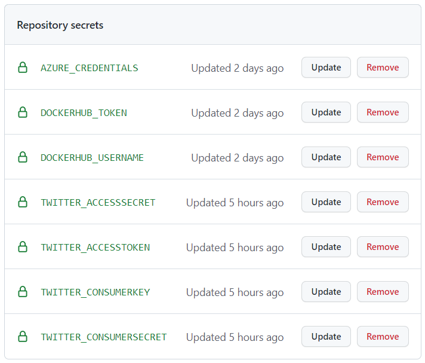

# DevOps demo

The purpose of this demo is to show how to deploy a Daprized application to Azure Kubernetes Service, using the [Dapr tool installer](https://github.com/marketplace/actions/dapr-tool-installer) GitHub Action. 

Open the _demo_devops.code-workspace_ file and click the **Open Workspace** button in the lower right corner. This will reload your Codespace and scope your Explorer to just the folders needed for this demo. 

To provision the infrastructure before the demo execute the following command in the terminal. This code is automatically run by the _demo.ps1_ script if the `-env` parameter is passed and *./components/local/local_secrets.json* file is not found.

```
./demo.ps1 -deployOnly
``` 

The workspace consists of one top level folders _DevOps_. The components folder is the folder installed during the `dapr init` run during the creation of the Codespace. This folder holds the default components pointing at [Redis](https://docs.dapr.io/reference/components-reference/supported-state-stores/setup-redis/). This folder is in the workspace so you can show the difference between that default component and the component in the _DevOps/components/azure_ folder. The component in the _components/azure_ folder is configured to use [Azure CosmosDB](https://docs.dapr.io/reference/components-reference/supported-state-stores/setup-azure-cosmosdb/). The point to make comparing the files is that as long as the name of the component does not change the code will work no matter what backing service is used. 

## Set Actions secrets

For the GitHub Actions workflow to succeed you must configure the following secrets:



The core of the demo is in the _sampleRequests.http_ file. At the top of the file are two _demo.ps1_ commands. One for running the requests against local resources and one for running against the cloud resources. Copy the desired command and run it in the terminal. This will start Dapr pointing to the appropriate components for the demo. The Dapr run command issued is output if you want to explain during the demo.

Running local
```
./demo.ps1 -env K8s
```

Running in cloud


When running locally against Redis you can use the Redis Visual Studio Code extension installed in the Codespace to see the state being stored there. 

When you are done with the demo you can clean up the cloud resources by running the _cleanUp.ps1_ script using the following commands: 

```
./cleanUp.ps1
```