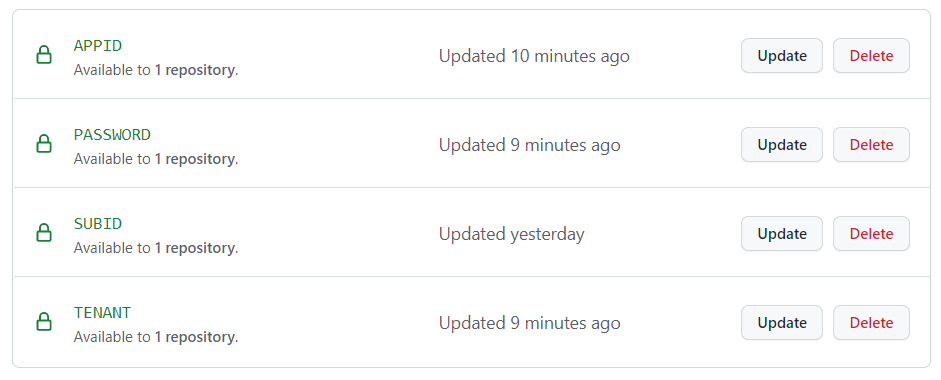

# MyDaprDemos 

To use these [Dapr](https://dapr.io) demos fork this repo and setup the Codespace secrets and assign them to your fork. 

## Create Codespace Secrets 

To create the Codespace secrets you will need an Azure service principal, tenant and subscription id. 

### Create Service Principal 

When the Codespace is created it runs a script to log in to the Azure CLI. It uses a service principal and needs the appid, password and tenant all of which are returned when you create a service principal. You can use an existing service principal or create a new one using the command below. You can learn more on the [Create an Azure service principal with the Azure CLI](https://docs.microsoft.com/en-us/cli/azure/create-an-azure-service-principal-azure-cli) page. 

``` 
az ad sp create-for-rbac --name DaprServicePrincipal 

{
  "appId": "00000000-0000-0000-0000-000000000000",
  "displayName": "DaprServicePrincipal",
  "name": "00000000-0000-0000-0000-000000000000",
  "password": "000000.0000000000.000000000-000000",
  "tenant": "00000000-0000-0000-0000-000000000000"
} 

``` 

Save this information because there is no way to retrieve it again. 

You will also need the id of the subscription you want to use. You can retrieve that running the following command. 

``` 
az account show -o json 

{
  "environmentName": "AzureCloud",
  "homeTenantId": "00000000-0000-0000-0000-000000000000",
  "id": "00000000-0000-0000-0000-000000000000",
  "isDefault": true,
  "managedByTenants": [],
  "name": "Subscription Name",
  "state": "Enabled",
  "tenantId": "00000000-0000-0000-0000-000000000000"
} 

``` 

### Set Codespace secrets 

With the appId, password, and tenant from the service principal and the id from the subscription you can set the Codespace secrets. You can learn how to set them on the [Managing encrypted secrets for your codespaces](https://docs.github.com/en/codespaces/managing-your-codespaces/managing-encrypted-secrets-for-your-codespaces) page. Make sure you assign them permission to the fork of this repository. 

 

## Running Demos 

To setup the infrastructure to run the demos run the `setup.ps1` PowerShell scripts in the _deploy_ folder under the demo you want to run. 

To switch to PowerShell from Bash use the following command in the terminal. 

```bash 
pwsh 
``` 

This will switch to PowerShell so the setup and tear down scripts can be executed. The setup script uses the Azure CLI to deploy a bicep file to deploy the required infrastructure. 

 To encourage best practices the components are all configured using secret stores. After the infrastructure is deployed the script will collect all the information needed to configure the components and write the data to a local_secrets.json file. This file is read in a secret store component used to configure the other components. The local_secrets.json file is listed in the .gitignore file of the repository so they are not accidentally committed.

 See the README.md files in each demo folder for instructions on how to run the demo. 